# wordlist stuff

_Last Updated: 11/06/2025 19:25 - Currently on: EXTERNAL_

## Current Pivot Chain

**External** → **Working on initial access**

## Visual Network Map

```mermaid
graph TD
    EXT[🌐 External<br/>MY-IP] -.->|Reconnaissance| TARGET[🎯 Target Network<br/>IP-RANGE]
    
    TARGET --> UNKNOWN1[❓ Unknown Machine 1]
    TARGET --> UNKNOWN2[❓ Unknown Machine 2]
    TARGET --> UNKNOWN3[❓ Unknown Machine 3]
    
    style EXT fill:#E6E6FA,stroke:#4B0082,stroke-width:2px
    style TARGET fill:#FFB6C1,stroke:#8B0000,stroke-width:3px
    style UNKNOWN1 fill:#F5F5F5,stroke:#696969,stroke-width:1px
    style UNKNOWN2 fill:#F5F5F5,stroke:#696969,stroke-width:1px
    style UNKNOWN3 fill:#F5F5F5,stroke:#696969,stroke-width:1px
```



## Machine Status Dashboard

|Machine|IP|OS|Status|Access Method|Next Action|Network Value|
|---|---|---|---|---|---|---|
|Unknown|TBD|TBD|❓ Unknown|Reconnaissance|Discover services|TBD|

## Active Tunnels & Access

```bash
# No active tunnels yet
# Commands will be added as network is compromised

# Template for future SSH tunnels:
# ssh -L LOCAL_PORT:TARGET_IP:TARGET_PORT user@COMPROMISED_HOST

# Template for RDP access:
# xfreerdp /v:IP:PORT /u:DOMAIN\\username /p:password

# Template for SMB access:
# smbclient //IP/SHARE -U domain/username%password
```

## Immediate Next Steps

1. **Priority 1:** Initial network reconnaissance
2. **Priority 2:** Service enumeration on discovered hosts
3. **Priority 3:** Identify initial attack vectors

## Quick Access Links

- **Network overview:** [[00-wordlist stuff-Overview]]
- **Credential tracker:** [[02-Credential-Tracker]]
- **Machines folder:** [[50-Scratchpad/Machines]]

---

**Legend:** ✅ Compromised | 🎯 Current Target | ❓ Known/Discovered | 🌐 External | 💻 Workstation | 🏰 Domain Controller | 🗄️ Database | 📁 File Server

#wordlist-stuff #network-map #50-scratchpad