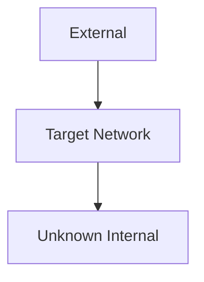

# README
**Platform:** PLATFORM  
**Start Date:** 11/06/2025  
**Completion Date:** TBD  
**Total Machines:** X  
**Network Complexity:** Beginner/Intermediate/Advanced

## Network Summary
Brief description of the network scenario and learning objectives

## Current Status
- **Machines Compromised:** 0/X
- **Current Position:** External
- **Next Targets:** Initial reconnaissance
- **Stuck On:** N/A

## Network Topology


## Compromise Chain
1. **External → ???:** Working on initial access

## Credentials Discovered
|Username|Password|Hash|Domain|Access Level|Source|
|---|---|---|---|---|---|
|||||||

## Key Network Techniques
*To be documented as network is explored*

## Machines Overview
```dataview
TABLE file.name as "Machine", 
  choice(contains(file.content, "✅ Compromised"), "✅", choice(contains(file.content, "🎯 Targeting"), "🎯", "❓")) as "Status",
  choice(contains(file.tags, "windows"), "🪟", choice(contains(file.tags, "linux"), "🐧", "❓")) as "OS"
FROM "06-CTF-Writeups"
WHERE contains(file.path, this.file.name)
SORT file.name
```

## Learning Outcomes
*To be updated as network progresses*
- **Network-specific skills:**
- **Tool combinations:**
- **Methodology insights:**

## Quick Links
- **Network Map:** [[01-Network-Map]]
- **Credentials:** [[02-Credential-Tracker]]
- **Machines Folder:** [[06-CTF-Writeups/README]]

#readme #network #PLATFORM